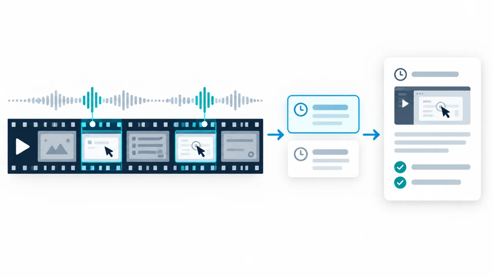
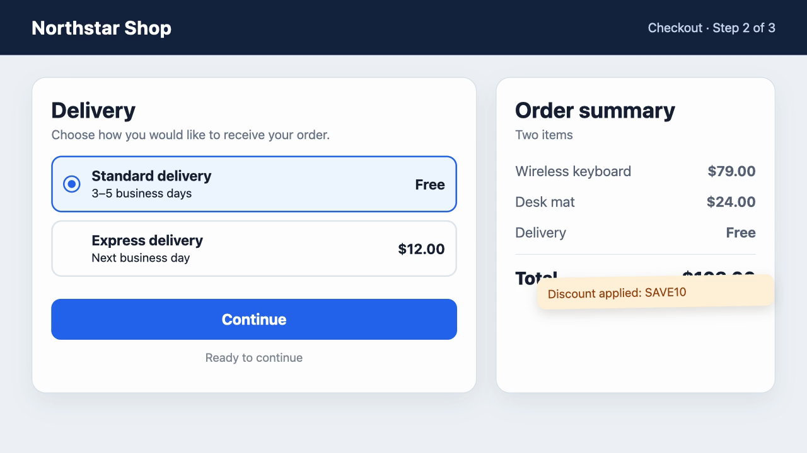

# Video Findings

**Turn narrated screen recordings into structured findings—with the relevant
evidence already attached.**

Record a product, website, prototype, design, or test session and talk through
what you notice. Video Findings turns the recording into a draft you can
review, refine, and reuse—without somebody watching the whole session again.

[](assets/video-findings-hero-v4.png)

## See it in action

### 1. Record a narrated walkthrough

[](https://github.com/user-attachments/assets/0862c1c1-45d2-4232-92ac-67865d407157)

Open the 82-second demo to hear the reviewer talk through a checkout while using
it naturally.

### 2. Turn the narration into a local timestamped index

The recording is transcribed locally. Relevant cues include:

```text
00:00:22.720–00:00:25.760
I select standard delivery and press continue.

00:00:25.760–00:00:31.520
Nothing happens. There is no visible response, so I cannot tell whether
the click was registered.
```

The timestamps identify where visual evidence is worth inspecting.
[Open the complete transcript](examples/narrated-demo-transcript.md).

### 3. Produce the reviewable report

Video Findings turns those moments into a compact report that can be reviewed
or used as the basis for tickets:

```text
00:22.720 — Continue provides no visible response
The reviewer selects standard delivery and presses Continue. They report no
visible response on two attempts and expect either the next step or a clear
error message.

🖼️ Embedded screenshot from the relevant moment · 00:27.120

01:08.720 — Discount message overlaps the order total
The reviewer reports that the discount message overlaps the total, making the
final amount difficult to read.

🖼️ Embedded screenshot from the relevant moment · 01:13.640
```

Every finding includes its selected screenshot directly in the report and links
back to the complete transcript. **[Open the resulting findings report](examples/narrated-demo-report.md).**

**Recording → local transcript → evidence-backed report.** Everything below
explains how that workflow stays fast, local-first, and adaptable.

## Install with your AI assistant

There is **one installation package for every supported local agent**:
**[download `video-findings.zip`](https://github.com/mneuschaefer/video-findings/releases/latest/download/video-findings.zip)**.

Copy this into Codex, Claude Code, or OpenCode:

```text
Install the portable Video Findings skill from https://github.com/mneuschaefer/video-findings/releases/latest/download/video-findings.zip in this agent's standard skill directory. Read SKILL.md first, create the ignored local preferences file from the included template, show me the read-only setup plan, reuse compatible local transcription tools and models, ask before installing or downloading anything, keep my recordings local, and verify the setup with the included demo.
```

Then give it a recording:

```text
Turn this narrated screen recording into reviewable findings: /path/to/recording.mov
```

### Where each agent loads it

Extract the ZIP once. It contains one folder named `video-findings`. Place that
folder in the location for your agent:

| Agent | Skill location |
|---|---|
| **Codex** | `~/.codex/skills/video-findings` |
| **Claude Code** | `~/.claude/skills/video-findings` |
| **OpenCode** | `~/.config/opencode/skills/video-findings`, or reuse the Claude Code location |

The same ZIP covers all three harnesses; only the installation directory differs.
OpenCode also discovers the Claude-compatible location directly. On the GitHub
release page, ignore the automatically generated **Source code** archives unless
you actually want the repository source rather than the installable skill.

The package includes the narrated demo and its matching VTT as a reference.
During setup, the assistant should transcribe the demo afresh and compare the
result afterward—not use the included VTT instead of testing transcription.

The complete local workflow requires macOS, local file and image access, Python
3.10+, and FFmpeg/FFprobe; Claude.ai without local execution can read the
instructions but cannot process a recording stored only on your Mac.

## What it does

Video Findings is useful for anyone who regularly works through longer,
information-dense material on screen and wants to turn their running commentary
into usable context or findings. That can be a critical review of an interface,
a recorded test session, a design walkthrough, or simply a way to capture and
structure your own thinking.

**Record → speak naturally → transcribe locally → locate relevant moments →
attach evidence → review and refine → reuse as issues or reports**

The transcript is the index. Its timestamps locate the relevant moments, so the
workflow can inspect and extract only the visual evidence that matters.

### Choose the output

By default, Video Findings creates one readable `Video Findings.md` with
timestamped findings, relevant images, and a link to the complete transcript.
For a one-off change, simply ask for a different format in your prompt.

During installation, the assistant creates this ignored local structure from
the included template:

```text
.video-findings/
└── preferences.md
```

The user does not need to edit it. Simply tell the assistant, for example,
“Remember for this project that reports should be in German and named
`Review.md`.” The assistant can save that choice after confirmation.

The entire `.video-findings/` directory is ignored by Git and excluded from
release packages, so local choices do not modify the shared skill. Current
prompts always take precedence. Do not store passwords or API keys there.
Repository maintainers can still edit [`SKILL.md`](SKILL.md) to change the
published default. You can also keep the standard report and pass it to another
skill, for example to create Jira tickets or user stories in your team's format.

## Local First by default

Video Findings uses **cheap local signals to decide what expensive multimodal
reasoning actually needs to see**.

- **Local transcription** keeps the complete recording on your Mac.
- **Transcript-guided analysis** replaces frame-by-frame analysis of the whole video.
- **Selective evidence** means screenshots or clips are extracted only around relevant moments.
- **Explicit escalation** means nothing is uploaded automatically.

This is a product choice: it reduces unnecessary context, processing time,
cost, and data transfer. If you use a cloud-hosted agent, only the transcript or
evidence you provide to that agent is subject to its provider's data handling.

## Optional screen annotation

A lightweight **live screen-annotation tool** can make the evidence clearer.
While recording, activate its overlay, draw a rectangle, circle, arrow, or
highlight, explain the point, clear the mark, and continue. Drawing mode should
capture pointer input so it cannot accidentally click or modify the application
underneath.

For macOS, [Quick Draw](https://github.com/maxchuquimia/quickdraw) is a small,
open-source example. It provides keyboard-selected drawing tools and uses
`Esc` to clear the overlay and then return to the underlying app. Build it from
source with Xcode, or use the inexpensive
[Mac App Store build](https://apps.apple.com/app/quick-draw/id1459010006).
Annotation is optional; Video Findings does not depend on a specific tool.

## When a screenshot is not enough

Flicker, animations, drag-and-drop, layout jumps, brief states, and other
time-dependent behavior cannot always be proven with one frame. Video Findings
can mark these findings as dynamic and preserve the relevant source interval.

| Policy | What the workflow inspects | Trade-off |
|---|---|---|
| **Local First** — default | Local transcript, screenshots, and locally extracted clips | Most private, fast, and economical |
| **Hybrid** — when needed | Only selected short clips go to a video-capable model after approval | More context for temporal issues with limited transfer |
| **Cloud-heavy** — optional | Larger sections or the full recording | Broader visual analysis, but higher transfer, cost, and privacy impact |

These are three policies within the same workflow, not separate skill variants.
Start locally and escalate only the evidence that needs it.

## Setup and supported input

The current release supports **local `.mov` and `.mp4` recordings on macOS**,
plus optional `.vtt` or `.srt` transcripts. QuickTime, the macOS screen recorder,
and downloaded Teams recordings are supported paths.

<details>
<summary><strong>Manual setup and first run</strong></summary>

Run the read-only setup check first:

```bash
./scripts/setup-macos
```

After reviewing the plan, install only the missing dependencies and one local
transcription model:

```bash
./scripts/setup-macos --install
```

Then place a recording in `input/` and ask your assistant to analyze it. See
[macOS setup](docs/setup-macos.md) for backend and model choices, and
[input formats](docs/input-formats.md) for details.

</details>

No configuration is required for the default analysis policy. Transcription
setup is a one-time step: the assistant shows packages, model download size
and location, then asks before installing. You can also install them yourself.
A verified local transcriber is saved and reused; normal Parakeet MLX runs do
not download models. See the [Mac installation recommendation](docs/setup-macos.md#recommended-one-time-setup-on-apple-silicon).

Advanced transcription
and evidence settings are documented in [macOS setup](docs/setup-macos.md) and
[temporal evidence](references/temporal-evidence.md).

## Known limitations

- The complete workflow is currently tested on macOS, primarily Apple Silicon.
- Transcript quality depends on audio, language, and the selected local model.
- Screenshots provide orientation, not proof of motion. For clearly dynamic
  findings, the report uses one orientation image and offers an optional short
  clip with or without audio. A second image is reserved for a comparison of
  two separately stable states.
- Generated findings are drafts: review them before creating tickets or reports.

## More detail

[Output artifacts](docs/output-artifacts.md) ·
[Architecture](docs/architecture.md) ·
[Privacy](docs/privacy.md) ·
[Report guidance](templates/dossier-guidance.md)

Video Findings is under active development and licensed under [MIT](LICENSE).
