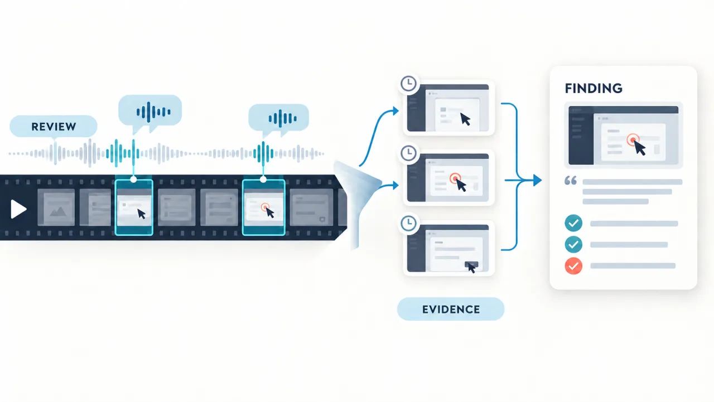
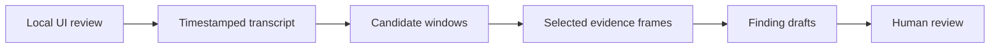

# Video Findings

Reviewing a complex interface is often easiest by recording the screen and
talking through what you notice, either alone or with a group. The recording
captures the context, but the useful observations still need to be found and
turned into clear findings. The Video Findings skill breaks the recording into
reviewable findings by connecting spoken comments with the relevant moments on
screen. Each finding includes a representative screenshot and the exact point
in the original video.

> **Platform support:** The current release supports macOS and is tested there.
> The Python core and FFmpeg media processing are portable, but setup, local
> transcription, and the complete workflow have not been adapted or tested on
> Linux or Windows.

[](assets/video-findings-hero-editorial-v2.png)

## Watch the demo

[](https://github.com/user-attachments/assets/0862c1c1-45d2-4232-92ac-67865d407157)

Select the preview to play the MP4 with sound.

*Voice generated by ElevenLabs.*

### Example output

**[Open the complete example report](examples/narrated-demo-report.md)**

> **Discount message overlaps the order total**
>
> **Confidence:** High · **Watch from:** 01:08.720
>
> The `Discount applied: SAVE10` message visibly covers the total label and
> amount, making the final amount difficult to read.

[](examples/narrated-demo-report.md)

The full report contains two findings. Each finding has one representative
screenshot and an exact link to the original video. Reviewers can inspect the
motion and audio without sorting through near-identical images.

## Install with Codex or Claude Code

Replace the placeholder with this repository's URL, then give the complete
prompt to your coding agent:

```text
Clone <REPOSITORY_URL> into a local folder named video-findings and prepare it on this Mac. Read SKILL.md first. Run ./scripts/setup-macos only as a read-only inspection. Reuse an installed transcription model and never download more than one. Recommend Parakeet TDT v3 on a compatible Mac, but let me choose another supported backend or model before installation. Explain the exact model choice, its reported download size, and each missing core dependency; only after my approval run ./scripts/setup-macos --install --yes with the same options. Finally run make test and make demo, keep all recordings local, and report what was reused or installed.
```

If you already downloaded the folder, use this prompt:

```text
Open this video-findings folder, read SKILL.md, prepare it on this Mac, run the tests and demo, and tell me when it is ready for a local QuickTime or downloaded Teams recording. Do not upload media anywhere.
```

## What it does

Version `0.2.0` works with narrated recordings in which spoken content only
makes sense together with the matching image or video segment. UI reviews are
the included tested example, not a restriction on how the skill can be used.

A 30-minute review may contain only five useful findings among hundreds of
spoken sentences. Someone then has to find those moments, capture evidence,
and separate what the reviewer saw from what they expected to happen.

Video Findings narrows that work down to a few reviewable steps:

> Use speech to find likely problem moments. Inspect only those video windows.
> Produce reviewable Markdown findings with an exact video timestamp and one
> representative screenshot per finding.

The tool creates detailed draft findings that stay close to what participants
said and what the recording shows. It does not invent a product, requirement,
severity, or expected behavior when that context is missing. The same source
transcript can later be used to regenerate the report or convert selected
findings into another format.

## Supported local files

| Input | Supported path |
|---|---|
| QuickTime Player screen recording | Local `.mov`, with recorded narration |
| macOS screen recording (`Shift-Command-5`) | Local `.mov`, with recorded narration |
| Microsoft Teams recording | `.mp4` downloaded to the Mac |
| Teams transcript | Optional matching `.vtt` or `.srt` downloaded with the recording |
| Other screen recordings | Local `.mp4` or `.mov` readable by FFmpeg |

The package does not connect to Teams, SharePoint, OneDrive, or other cloud
video services. Download synced files completely before analysis; Finder
placeholders are not enough. See
[`docs/input-formats.md`](docs/input-formats.md).

## Why start with the transcript?

A transcript provides a practical index of the recording. In most cases, there
is no need to send every video frame to a multimodal model.



This reduces the number of frames that need inspection. It also lowers
processing cost and leaves a clearer audit trail.

## AI review across languages

The preparation script does not decide what counts as a finding. It writes
every timestamped transcript cue to `transcript-cues.json`. Keyword matches
can suggest where to look, but real reviews often describe problems vaguely or
indirectly. Keywords alone cannot provide reliable coverage across languages.

The agent reads the complete cue manifest, identifies possible findings in any
transcript language, and inspects the matching video windows. By default, the
finding titles, explanations, statuses, and decisions use the dominant language
of the recording or transcript. Direct quotes and visible UI labels stay in
their original language. The user can request a different output language.

## macOS setup

Run the read-only check first:

```bash
./scripts/setup-macos
```

After reviewing the plan, install the missing core dependencies and the one
selected model:

```bash
./scripts/setup-macos --install
```

The command asks for confirmation. An agent may add `--yes` only after the user
has reviewed and approved the plan. Setup makes sure that one local
transcription model works. If a compatible model is already ready, it does not
download another one.

Setup chooses the smallest necessary action:

| What is already available | Default action |
|---|---|
| MacParakeet with a local Parakeet model | Reuse it; download nothing |
| Complete local Whisper setup | Reuse it; download nothing |
| MacParakeet installed, but no model | Download recommended Parakeet TDT v3, reported by MacParakeet as ~465 MB |
| MacParakeet unavailable and no model | Install the Whisper fallback and download `base`, 142 MiB |

To use another model, change the read-only plan before approving it:

```bash
./scripts/setup-macos --backend parakeet --parakeet-model parakeet-v3
./scripts/setup-macos --backend whisper --model small
```

| Dependency | Needed for | Setup behavior |
|---|---|---|
| Homebrew | Managed macOS installation | Must already exist; never installed silently |
| Python 3.10+ | Transcript parsing and report generation | Installed only if missing or too old |
| FFmpeg + FFprobe | MOV/MP4 probing, audio, frames | Installed only if missing |
| MacParakeet + Parakeet model | Preferred local transcription | Reused when ready; otherwise the one selected Parakeet model is downloaded |
| `whisper.cpp` | Fallback when MacParakeet is unavailable | Installed only if no ready backend exists or explicitly selected |
| multilingual Whisper model | One fallback model | Defaults to `base` (142 MiB); another model can be selected before installation |

The Python core uses only the standard library. The setup script does not
modify shell startup files, request administrator privileges, or upload media.
Before it changes the Mac, it reports the chosen transcription backend and
each missing Homebrew formula. Full details are in
[`docs/setup-macos.md`](docs/setup-macos.md).

If a compatible model is already installed, the additional speech model
download is 0 MiB. Otherwise, setup downloads exactly one model. The tested
recommendation for a Mac with MacParakeet is Parakeet TDT v3, reported by
MacParakeet as about 465 MB. If MacParakeet is unavailable, setup uses Whisper
`base` at 142 MiB. You can instead choose `tiny` at 75 MiB, `small` at 466 MiB,
`medium` at 1.5 GiB, or `large` at 2.9 GiB. Choose a larger or newer compatible
model before installation if the device or expected audio quality calls for
one. Homebrew may also download missing Python, FFmpeg, or `whisper.cpp`
bottles and system-specific dependencies. The plan lists these separately from
the model download. The Whisper sizes come from the official
[whisper.cpp model table](https://github.com/ggml-org/whisper.cpp#memory-usage).

Parakeet TDT v3 is the tested and preferred backend. You can select a newer
MacParakeet-compatible model from `macparakeet-cli models list` with
`--parakeet-model`. To use an installed variant, set
`VIDEO_FINDINGS_PARAKEET_MODEL`. You can provide an existing compatible
Whisper model through `VIDEO_FINDINGS_MODEL_PATH`. The workflow never switches
to a newer model automatically.

When a backend is ready, the installer runs a transcription smoke test. If the
Whisper Metal backend fails, the wrapper retries locally with
`whisper.cpp --no-gpu` and remembers that project-local fallback. See
FluidAudio's current
[ASR model guide](https://github.com/FluidInference/FluidAudio/blob/main/Documentation/Models.md)
for other available models.

## Two-minute smoke test

```bash
make test
make demo
open output/demo/report.md
```

The demo creates a synthetic recording locally and reads the supplied VTT. It
merges a repeated issue while keeping its separate evidence windows. By
default, it writes one initial screenshot for each candidate:

```text
output/demo/
├── assets/
│   └── finding-*.jpg
├── candidates.json
├── motion-1s.tsv
├── motion.tsv
├── motion-summary.json
├── transcript-source.vtt
├── transcript-cues.json
├── transcript.md
└── report.md
```

The final AI-reviewed output also includes `findings.json`. The complete
timestamped transcript is preserved so reports, summaries, tickets, or other
formats can be generated again without retranscribing the recording. See
[`docs/output-artifacts.md`](docs/output-artifacts.md) for the complete artifact
contract.

## Analyze a QuickTime or macOS screen recording

With narration but without a separate transcript:

```bash
./scripts/analyze-recording \
  --video "/path/QuickTime Screen Recording.mov" \
  --output output/quicktime-review
```

The script checks the input and uses an installed MacParakeet model when one is
ready. Otherwise, it uses a ready local `whisper.cpp` setup. It preserves every
timestamped cue and creates optional keyword leads. The agent then reviews the
complete transcript for meaning and collects the visual evidence for each
finding. The keyword script does not make that decision. Each final finding
normally contains one representative screenshot, a link to the original video,
and the exact timestamp from which to continue watching.

The first pass stays sparse. A compact numeric movement index helps route
timing-dependent findings but creates no extra images or clips. Such findings
are marked as dynamic. A user can select one afterwards, for example: "Extract
finding 3 as a short clip with audio and convert it to my ticket format." The
selected interval can use an interaction, flicker, latency, audio-visual, or
slow-motion evidence mode. Add `--no-audio` when a silent attachment is
preferred. The report still uses one representative image unless the user asks
for more.

## Analyze a downloaded Teams recording

Use the matching Teams transcript when one is available:

```bash
./scripts/analyze-recording \
  --video "/path/Teams Review.mp4" \
  --transcript "/path/Teams Review.vtt" \
  --output output/teams-review
```

If there is no downloaded transcript, omit `--transcript` to use local
transcription. The transcript and video need the same start time for their
timestamps to align.

## What each finding separates

| Layer | Meaning |
|---|---|
| Observation | What the transcript or sampled frames directly support |
| Reviewer expectation | What the reviewer says should happen |
| Interpretation | A tentative classification or explanation |
| Human decision | Confirm, rewrite, or discard |

A confident comment in the recording does not prove that a defect exists.
Sparse frames also cannot show flicker, latency, or a brief intermediate state.
Those cases need denser inspection of the candidate interval.

## Repository layout

```text
video-findings/
├── SKILL.md                  # Agent workflow and evidence rules
├── src/                      # Deterministic transcript preparation
├── scripts/                  # Setup, transcription, media, and packaging
├── prompts/                  # Detection and verification guidance
├── templates/                # Portable Markdown output format
├── examples/                 # Synthetic transcript and expected behavior
├── docs/                     # Setup, formats, architecture, privacy, limits
└── tests/                    # Parser, Teams VTT, detection, packaging checks
```

The preserved transcript and `findings.json` are the stable boundaries.
Transcription tools, agents, evidence modes, and future exporters can change
without requiring another transcription pass.

## Build a release

```bash
make package
```

This creates `dist/video-findings-<version>.tar.gz` and a SHA-256 checksum.
Recordings, downloaded models, generated reports, caches, and temporary
validation files are excluded.

## Privacy and scope

The included scripts run locally and make no network calls during analysis.
They use the network only when the user approves the installation of Homebrew
packages or a speech model. The complete workflow stays local only when the
agent that interprets the transcript is also local.

The workflow assumes that the user has handled any notice or permission needed
for recording. Participants should be told when a meeting or group session is
being recorded. This note does not block analysis of an existing recording.

Sending audio, transcripts, or screenshots to a cloud agent means those
artifacts leave the machine. See [`docs/privacy.md`](docs/privacy.md) and
[`docs/limitations.md`](docs/limitations.md).

The package does not include automatic Jira, Linear, or Azure DevOps tickets.
It also has no Teams API access, Obsidian plugin, cloud backend, or user
accounts.

## Project status

Version `0.2.0` is a portable, testable foundation for macOS. UI reviews are
the included tested example. It automates deterministic preparation and local
transcription, while an agent or person still performs the visual review so
uncertain findings remain marked as such.

## License

[MIT](LICENSE)
