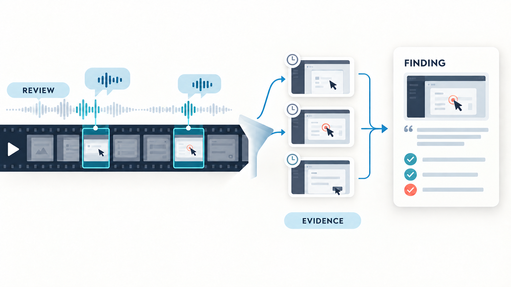
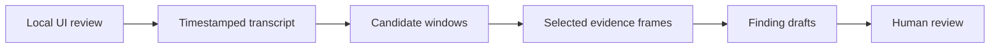

# Video Findings

**Turn narrated videos into evidence-backed visual findings.**

> **Platform status:** The current release supports and is tested on macOS.
> Its standard-library Python core and FFmpeg-based media pipeline are designed
> to be portable, but setup, local transcription, and the complete
> workflow have not yet been adapted or verified for Linux or Windows.



## See it on a narrated review

[](https://github.com/user-attachments/assets/0862c1c1-45d2-4232-92ac-67865d407157)

Select the preview to watch the MP4 with sound, or
[download the versioned demo file](assets/narrated-demo.mp4).

*Voice generated by ElevenLabs.*

### Example output

**[Open the complete example report](examples/narrated-demo-report.md)**

> **Discount message overlaps the order total**
>
> **Confidence:** High · **Watch from:** 01:08.720
>
> The `Discount applied: SAVE10` message visibly covers the total label and
> amount, making the final amount difficult to read.

[](examples/narrated-demo-report.md)

The full example contains two findings. Each has one representative screenshot
and an exact link back to the original video, so a reviewer can inspect the
motion and audio instead of relying on a stack of near-identical images.

## Install it with Codex or Claude Code

Replace the placeholder with this repository's URL, then paste the complete
prompt into your coding agent:

```text
Clone <REPOSITORY_URL> into a local folder named video-findings and prepare it on this Mac. Read SKILL.md first. Run ./scripts/setup-macos only as a read-only inspection. Reuse an installed transcription model and never download more than one. Recommend Parakeet TDT v3 on a compatible Mac, but let me choose another supported backend or model before installation. Explain the exact model choice, its reported download size, and each missing core dependency; only after my approval run ./scripts/setup-macos --install --yes with the same options. Finally run make test and make demo, keep all recordings local, and report what was reused or installed.
```

Already downloaded the folder? Ask the agent:

```text
Open this video-findings folder, read SKILL.md, prepare it on this Mac, run the tests and demo, and tell me when it is ready for a local QuickTime or downloaded Teams recording. Do not upload media anywhere.
```

## The use case

The included `0.1.4` analysis profile starts with narrated UI reviews. The
underlying method is broader: use transcript cues to locate moments whose
meaning or evidence depends on the matching visual state.

A 30-minute UI review may contain five useful findings hidden inside hundreds
of conversational sentences. Afterwards, somebody still has to locate the
right moments, capture screenshots, and reconstruct what was observed and what
the reviewer merely expected.

Video Findings turns that work into a small, inspectable evidence pipeline:

> Use speech to find likely problem moments. Inspect only those video windows.
> Produce reviewable Markdown findings with an exact video timestamp and one
> representative screenshot per finding.

It is not another meeting summarizer and does not create final tickets
automatically. Every result remains a draft for a product, QA, UX, or
requirements professional to confirm, rewrite, or discard.

## Supported local inputs

| Input | Supported path |
|---|---|
| QuickTime Player screen recording | Local `.mov`, with recorded narration |
| macOS screen recording (`Shift-Command-5`) | Local `.mov`, with recorded narration |
| Microsoft Teams recording | `.mp4` downloaded to the Mac |
| Teams transcript | Optional matching `.vtt` or `.srt` downloaded with the recording |
| Other screen recordings | Local `.mp4` or `.mov` readable by FFmpeg |

The package does not connect to Teams, SharePoint, OneDrive, or a cloud video
service. Synced files must be fully downloaded, not Finder placeholders. See
[`docs/input-formats.md`](docs/input-formats.md).

## Why transcript-first?

Sending every video frame to a multimodal model is usually unnecessary. The
transcript already acts as a search index for the recording.



This approach is faster, cheaper, more data-minimizing, and easier to audit
than processing the entire recording visually.

## Language-independent AI review

The preparation script does **not** decide what the findings are. It preserves
every timestamped transcript cue in `transcript-cues.json`. Simple keyword
matching may add early leads, but wording in real reviews is often vague,
indirect, or context-dependent—and keyword coverage is especially unreliable
across languages.

The agent must therefore read the complete cue manifest semantically, identify
possible findings in any transcript language, and then inspect the matching
visual windows. Unless the user asks for another output language, the final
finding titles, explanations, statuses, and decisions use the dominant language
of the recording or transcript. Direct quotes and visible UI labels remain in
their original language.

## Dependencies on macOS

Run the read-only check first:

```bash
./scripts/setup-macos
```

After reviewing the plan, install its missing core dependencies and single
selected model:

```bash
./scripts/setup-macos --install
```

The command asks for confirmation. Agents may add `--yes` only after the user
has reviewed and explicitly approved the displayed plan. Setup leaves the Mac
with one working local transcription model, but never downloads a second model
when a compatible one is already ready.

The setup decision is intentionally conservative:

| What is already available | Default action |
|---|---|
| MacParakeet with a local Parakeet model | Reuse it; download nothing |
| Complete local Whisper setup | Reuse it; download nothing |
| MacParakeet installed, but no model | Download recommended Parakeet TDT v3, reported by MacParakeet as ~465 MB |
| MacParakeet unavailable and no model | Install the Whisper fallback and download `base`, 142 MiB |

To choose another model, change the read-only plan before approving it:

```bash
./scripts/setup-macos --backend parakeet --parakeet-model parakeet-v3
./scripts/setup-macos --backend whisper --model small
```

| Dependency | Needed for | Setup behavior |
|---|---|---|
| Homebrew | Managed macOS installation | Must already exist; never installed silently |
| Python 3.10+ | Transcript parsing and report generation | Installed only if missing or too old |
| FFmpeg + FFprobe | MOV/MP4 probing, audio, frames | Installed only if missing |
| MacParakeet + Parakeet model | Preferred local transcription | Reused when ready; otherwise the one selected Parakeet model is downloaded |
| `whisper.cpp` | Fallback when MacParakeet is unavailable | Installed only if no ready backend exists or explicitly selected |
| multilingual Whisper model | One fallback model | Defaults to `base` (142 MiB); another model can be selected before installation |

The deterministic Python core uses only the standard library. The setup script
does not modify shell startup files, request administrator privileges, or
upload media. Full details are in [`docs/setup-macos.md`](docs/setup-macos.md).
Before changing the machine, it reports the chosen transcription backend and
every missing Homebrew formula.

**The additional speech-model download is 0 MiB when a compatible model is
already installed.** Otherwise setup downloads exactly one model. On a Mac with
MacParakeet, the tested recommendation is Parakeet TDT v3 (~465 MB as reported
by MacParakeet). Without MacParakeet, the minimum functional fallback is
Whisper `base` at 142 MiB. Optional Whisper choices range from `tiny` at 75 MiB
to a full `large` model at 2.9 GiB (`small` 466 MiB; `medium` 1.5 GiB). Start
with Parakeet v3, or Whisper `base` when Parakeet is unavailable; choose a
larger or newer compatible model before installation only when the device or
expected audio quality justifies it. Homebrew may separately fetch missing
Python, FFmpeg, or `whisper.cpp` bottles and system-specific dependencies; the
plan lists these core formulae separately from the single model download.
The alternative sizes follow the official
[whisper.cpp model table](https://github.com/ggml-org/whisper.cpp#memory-usage).

The currently tested and preferred backend is Parakeet TDT v3. This is a
tested baseline, not a permanent lock: a newer
MacParakeet-compatible model listed by `macparakeet-cli models list` can be
selected before installation with `--parakeet-model`; an already installed
variant can also be selected through `VIDEO_FINDINGS_PARAKEET_MODEL`. A
compatible existing Whisper model can be supplied with
`VIDEO_FINDINGS_MODEL_PATH`. The workflow never changes to a newer model
automatically. The installer runs a transcription smoke test when a backend is
ready. If the Whisper Metal backend fails, the wrapper retries locally with
`whisper.cpp --no-gpu` and remembers that stable project-local fallback.
See FluidAudio's current
[ASR model guide](https://github.com/FluidInference/FluidAudio/blob/main/Documentation/Models.md)
for the upstream model landscape.

## Two-minute smoke test

```bash
make test
make demo
open output/demo/report.md
```

The demo creates a synthetic recording locally, reads its supplied VTT,
deduplicates a repeated issue while retaining separate evidence windows, and
writes one initial screenshot per candidate by default:

```text
output/demo/
├── assets/
│   └── finding-*.jpg
├── candidates.json
├── transcript-cues.json
└── report.md
```

## Analyze a QuickTime or macOS screen recording

With narration but without a separate transcript:

```bash
./scripts/analyze-recording \
  --video "/path/QuickTime Screen Recording.mov" \
  --output output/quicktime-review
```

The script verifies the input, prefers an already installed MacParakeet model,
falls back to a ready local `whisper.cpp` setup, preserves every timestamped
cue, and creates optional keyword leads. The agent—not the keyword script—then
reviews the complete transcript semantically and extracts any additional visual
evidence required for the final findings. Each final finding normally contains
one representative screenshot plus a link to the original video and the exact
timestamp from which to continue watching.

If a timing-dependent problem needs closer diagnosis, add
`--frame-mode dense` to create start, middle, and end samples for each candidate
window. This is an inspection mode; multiple near-identical screenshots should
not be copied into the final report unless the user explicitly asks for them.

## Analyze a downloaded Teams recording

Use the matching Teams transcript when one is available:

```bash
./scripts/analyze-recording \
  --video "/path/Teams Review.mp4" \
  --transcript "/path/Teams Review.vtt" \
  --output output/teams-review
```

Without a downloaded transcript, omit `--transcript` to use local
transcription. The transcript and video must share the same start time for
their timestamps to align.

## What a finding separates

| Layer | Meaning |
|---|---|
| Observation | What the transcript or sampled frames directly support |
| Reviewer expectation | What the reviewer says should happen |
| Interpretation | A tentative classification or explanation |
| Human decision | Confirm, rewrite, or discard |

A confident statement is not automatically a verified defect. Sparse frames
also cannot prove flicker, latency, or a brief intermediate state; those cases
need denser inspection of the candidate interval.

## Repository structure

```text
video-findings/
├── SKILL.md                  # Agent workflow and evidence rules
├── src/                      # Deterministic transcript preparation
├── scripts/                  # Setup, transcription, media, and packaging
├── prompts/                  # Detection and verification guidance
├── templates/                # Portable Markdown output format
├── examples/                 # Synthetic transcript and expected behavior
├── docs/                     # Setup, formats, architecture, privacy, limits
└── tests/                    # Parser, Teams VTT, detection, packaging checks
```

The stable boundary is `candidates.json`. Transcription tools, agents, or future
exporters can change without coupling them to the media scripts.

## Package a release

```bash
make package
```

This creates `dist/video-findings-<version>.tar.gz` and a SHA-256 checksum.
Recordings, downloaded models, generated reports, caches, and temporary
validation files are excluded.

## Privacy and scope

The included scripts run locally and make no network calls during analysis.
Network access is used only when the user explicitly installs Homebrew packages
or downloads a Whisper model. The whole workflow is only fully local when the
agent used for interpretation is local too.

Sending audio, transcripts, or screenshots to a cloud agent means those
artifacts leave the machine. See [`docs/privacy.md`](docs/privacy.md) and
[`docs/limitations.md`](docs/limitations.md).

Not included: automatic Jira/Linear/Azure DevOps tickets, Teams API access, an
Obsidian plugin, a cloud backend, or user accounts.

## Project status

Version `0.1.4` is a portable macOS-oriented package and a testable V1
foundation with an initial UI-review profile. Deterministic preparation and
local transcription are automated; nuanced visual verification remains an
explicit agent or human task so uncertainty stays visible.

## License

[MIT](LICENSE)
