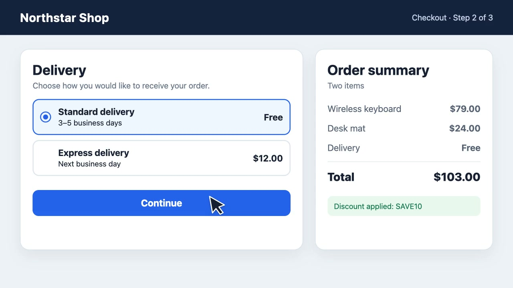
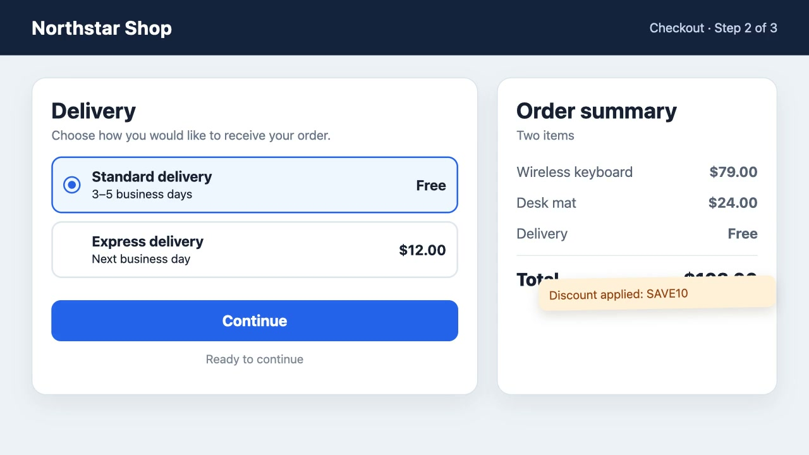

# Checkout review findings

**Source video:** [Narrated checkout review](https://github.com/user-attachments/assets/0862c1c1-45d2-4232-92ac-67865d407157)

**Complete transcript:** [narrated-demo-transcript.md](narrated-demo-transcript.md)

## 00:22.720 — Continue provides no visible response

The reviewer selects `Standard delivery` and presses `Continue`. They report
that nothing happens and there is no visible response, so they cannot tell
whether the click was registered. A second attempt produces the same result.
They expect either the next step or a clear error message.

*Evidence · 00:27.120 — Continue after the reported first attempt.*

## 01:08.720 — Discount message overlaps the order total

The reviewer reports that the discount message overlaps the total, making the
final amount difficult to read.

*Evidence · 01:13.640 — Discount message at the reported overlap.*

## Source material

[Open the complete timestamped transcript](narrated-demo-transcript.md) or the
[source VTT](narrated-demo-transcript.vtt).
